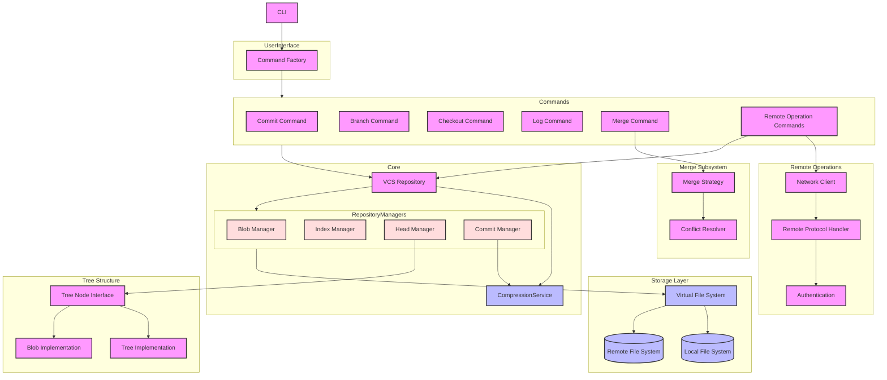

# Задание 13 | VCS

Сделано как 2 диаграммы, так как неудобно на одной:

1. Mermaid диаграмма классов: [class_diagram.mermaid](./diagrams/class_diagram.mermaid), [editor link](https://www.mermaidchart.com/app/projects/e8b244f9-a05c-4830-bf12-d70ae0a6d8e1/diagrams/bc5aa98a-b01b-465f-9554-61c60a71d768/version/v0.1/edit), [CSV link](https://www.mermaidchart.com/raw/bc5aa98a-b01b-465f-9554-61c60a71d768?theme=light&version=v0.1&format=svg).

1. Mermaid диаграмма компонентов: [component_digram.mermaid](./diagrams/component_digram.mermaid), [editor link](https://www.mermaidchart.com/app/projects/e8b244f9-a05c-4830-bf12-d70ae0a6d8e1/diagrams/318fd620-dc1b-4375-92a9-4ec0d62a96d7/version/v0.1/edit), [CSV link](https://www.mermaidchart.com/raw/318fd620-dc1b-4375-92a9-4ec0d62a96d7?theme=light&version=v0.1&format=svg).

1. Структура в Kotlin-подобном языке: [structure.txt](./structure.txt).

## Коментарии к диаграммам:

1. `merge` is expressed as:
```java
List<BLobData> theirBlobs = HeadManager.loadTreeFromCurrentHead(sourceBranch).getBlobs();
List<BLobData> ourBlobs = HeadManager.loadTreeFromCurrentHead().getBlobs();
return strategy.merge(ourBlobs, theirBlobs);
```

1. `checkout` is expressed as:
```java
TreeNode root = HeadManager.loadTreeFromCurrentHead();
List<BLobData> blobs = root.getBlobs();
IndexManager.register(blobs);
IndexManager.updateWorkingDirWithTrackedFiles();
```

1. Описание `BlobData`:
```kotlin
BlobData:
    file: string // actual file in the working project
    blob: string // blob with the file content dedicated to the current file revision
```

## Участники

1. Владислав Артюхов
1. Дмитрий Артюхов
1. Дмитрий Юкачев


## Диаграмма классов

```mermaid
classDiagram
    %% Core VFS Components
    class VFS {
        <<interface>>
        +VFSFile createFile(String path)
        +VFSDirectory createDirectory(String path)
        +void delete(String path)
        +List~VFSFile~ listFiles(String path)
        +VFSFile getFile(String path)
        +VFSDirectory getDirectory(String path)
        +void move(String sourcePath, String destinationPath)
        +void copy(String sourcePath, String destinationPath)
        +void rename(String oldPath, String newPath)
        +boolean exists(String path)
        +boolean isFile(String path)
        +boolean isDirectory(String path)
    }

    class VFSFile {
        <<interface>>
        +String getName()
        +String getPath()
        +long getSize()
        +Date getLastModified()
        +byte[] read()
        +void write(byte[] data)
        +void delete()
        +void move(String destinationPath)
        +void copy(String destinationPath)
        +void rename(String newName)
        +boolean exists()
        +boolean isFile()
        +boolean isDirectory()
        +VFSDirectory getParent()
    }

    class VFSDirectory {
        <<interface>>
        +List~VFSFile~ getFiles()
        +List~VFSDirectory~ getDirectories()
        +VFSFile createFile(String name)
        +VFSDirectory createDirectory(String name)
    }

    class LocalVFS {
    }

    class RemoteVFS {
        +RemoteVFS(String host, Credentials credentials)
    }

    %% Core Manager Interfaces
    class IBlobManager {
        <<interface>>
        +List~BlobData~ createBlobs(String path)
    }

    class IIndexManager {
        <<interface>>
        +void register(List~BlobData~ blobs)
        +void remove(String path)
        +void clean()
        +List~BlobData~ getCurrentTrackedFiles()
        +Map~FileStatus,List~String~~ getUntrackedFiles()
        +Map~FileStatus,List~String~~ getReadyToCommitFiles()
        +void updateWorkingDirWithTrackedFiles()
    }

    class IHeadManager {
        <<interface>>
        +String getHead()
        +void updateHead(Commit commit)
        +void createBranch(String name)
        +void removeBranch(String name)
        +List~String~ listBranches()
        +String branchToCommitHash(String branchName)
        +TreeNode loadTreeFromCurrentHead()
        +TreeNode loadTreeFromRevision(String revision)
    }

    class ICommitManager {
        <<interface>>
        +Commit createCommit(String message, List~BlobData~ blobs, String parentCommitHash)
        +List~Commit~ revisionCommits(String revision)
        +Commit revisionLastCommit(String revision)
        +List~BlobData~ blobsFromCommit(Commit commit)
    }

    %% Manager Implementations
    class BlobManager {
        -VFS vfs
        -String workingDir
    }

    class IndexManager {
        -VFS vfs
        -String workingDir
    }

    class HeadManager {
        -VFS vfs
        -String workingDir
    }

    class CommitManager {
        -VFS vfs
        -String workingDir
        -ICompressionService compressionService
    }

    %% Command Interface and Base Class
    class ICommand {
        <<interface>>
        +CommandResult execute()
    }

    class VCSCommand {
        <<abstract>>
        #VCSRepository repository
        +VCSCommand(VCSRepository repository)
    }

    %% Specific Commands
    class CommitCommand {
        -String message
        -Date date
        -String author
    }

    class CreateBranchCommand {
        -String name
    }

    class RemoveBranchCommand {
        -String name
    }

    class CheckoutCommand {
        -String revision
    }

    class LogCommand {
    }

    class MergeCommand {
        -IMergeStrategy strategy
        -String sourceBranch
    }

    class CloneCommand {
        -String url
        -String localPath
    }

    class FetchCommand {
        -String remote
    }

    class PullCommand {
        -String remote
        -String branch
    }

    class PushCommand {
        -String remote
        -String branch
    }

    %% CLI Interface
    class ICli {
        <<interface>>
        +CommandResult parseAndExecuteCommand(String input)
    }

    class VCSCli {
        -VCSRepository repository
        -CommandFactory commandFactory
    }

    class CommandFactory {
        +ICommand createCommand(String name, String[] args)
    }

    %% Merge Strategy
    class IMergeStrategy {
        <<interface>>
        +MergeResult merge(List~BlobData~ ours, List~BlobData~ theirs)
    }

    class IConflictResolver {
        <<interface>>
        +List~MergeConflict~ detectConflicts(TreeNode base, TreeNode ours, TreeNode theirs)
        +boolean resolveConflict(MergeConflict conflict, VFSFile resolution)
        +VFSFile autoResolve(MergeConflict conflict)
    }

    %% TreeNode hierarchy
    class ITreeNode {
        <<interface>>
        +List~ITreeNode~ children()
        +boolean isBlob()
        +List~BlobData~ getBlobs()
    }

    class Tree {
        -List~ITreeNode~ nodes
    }

    class Blob {
        -BlobData data
    }

    %% Added components from previous solution
    class ICompressionService {
        <<interface>>
        +byte[] compress(byte[] data)
        +byte[] decompress(byte[] compressedData)
        +byte[] calculateDelta(byte[] original, byte[] modified)
        +byte[] applyDelta(byte[] original, byte[] delta)
    }

    class ZlibCompressionService {
    }


    class INetworkClient {
        <<interface>>
        +void connect(String url, Credentials credentials)
        +byte[] download(String path)
        +void upload(String path, byte[] data)
        +void disconnect()
    }

    class HTTPNetworkClient {
        +void connect(String url, Credentials credentials)
        +byte[] download(String path)
        +void upload(String path, byte[] data)
        +void disconnect()
    }

    %% Main Repository
    class VCSRepository {
        -IBlobManager blobManager
        -IIndexManager indexManager
        -IHeadManager headManager
        -ICommitManager commitManager
        -ICompressionService compressionService
        -List~Remote~ remotes
        +void init()
        +void addRemote(Remote remote)
        +void removeRemote(String name)
        +List~Remote~ getRemotes()
    }

    %% Data Classes
    class Credentials {
        +String username
        +String password
    }

    class Remote {
        +String host
        +Credentials credentials
    }

    class BlobData {
        +String file
        +String blob
    }

    class Commit {
        +String hash
        +String message
        +Date date
        +String author
        +String parentHash
    }

    class CommandResult {
        +boolean success
        +String message
        +Object data
    }

    class MergeResult {
        +boolean success
        +List~MergeConflict~ conflicts
    }

    class MergeConflict {
        +String path
        +VFSFile base
        +VFSFile ours
        +VFSFile theirs
    }

    class FileStatus {
        <<enumeration>>
        MODIFIED
        NEW
        REMOVED
    }

    %% Relationships
    VFS <|.. LocalVFS
    VFS <|.. RemoteVFS

    IBlobManager <|.. BlobManager
    IIndexManager <|.. IndexManager
    IHeadManager <|.. HeadManager
    ICommitManager <|.. CommitManager

    ICommand <|.. VCSCommand
    VCSCommand <|-- CommitCommand
    VCSCommand <|-- CreateBranchCommand
    VCSCommand <|-- RemoveBranchCommand
    VCSCommand <|-- CheckoutCommand
    VCSCommand <|-- LogCommand
    VCSCommand <|-- MergeCommand
    VCSCommand <|-- CloneCommand
    VCSCommand <|-- FetchCommand
    VCSCommand <|-- PullCommand
    VCSCommand <|-- PushCommand

    ICli <|.. VCSCli

    ITreeNode <|.. Tree
    ITreeNode <|.. Blob

    ICompressionService <|.. ZlibCompressionService
    INetworkClient <|.. HTTPNetworkClient

    BlobManager --> VFS
    IndexManager --> VFS
    HeadManager --> VFS
    CommitManager --> VFS
    CommitManager --> ICompressionService

    VCSCli --> VCSRepository
    VCSCli --> CommandFactory
    CommandFactory --> ICommand : creates

    VCSCommand --> VCSRepository
    MergeCommand --> IMergeStrategy

    VCSRepository --> IBlobManager
    VCSRepository --> IIndexManager
    VCSRepository --> IHeadManager
    VCSRepository --> ICommitManager
    VCSRepository --> ICompressionService
    VCSRepository --> Remote

    HeadManager --> TreeNode : creates
    TreeNode --> BlobData : contains

    RemoteVFS --> Credentials
    Remote --> Credentials

    IMergeStrategy --> MergeResult : returns
    MergeResult --> MergeConflict
```




## Диаграмма компонентов

